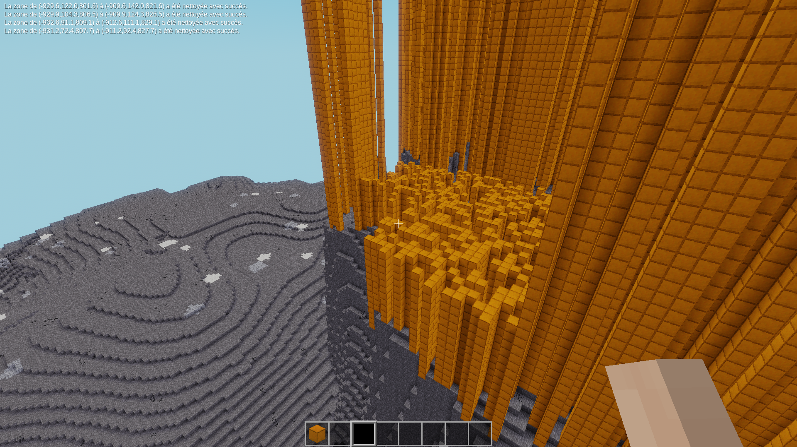

# Large decoration for testing in Luanti

This mod simply add a new biome named ``large_debug_decoration_biome:debug_large_decoration`` that contain tall bronze block tower, for testing how such large decoration interact with world generation when spread across multiple mapgen chunk.

(both biomegen and the default mapgen fail to generate them correctly)

I recommend the use of the ``findbiome`` mod and of the command ``/findbiome large_debug_decoration_biome:debug_large_decoration``

